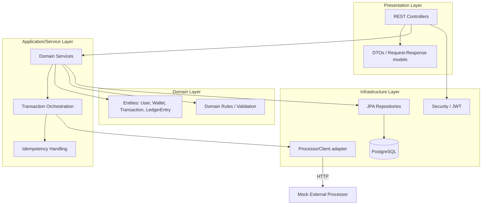
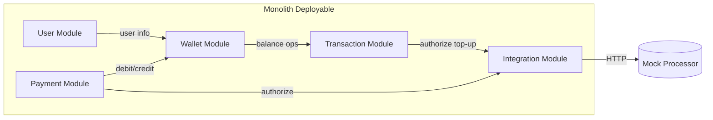
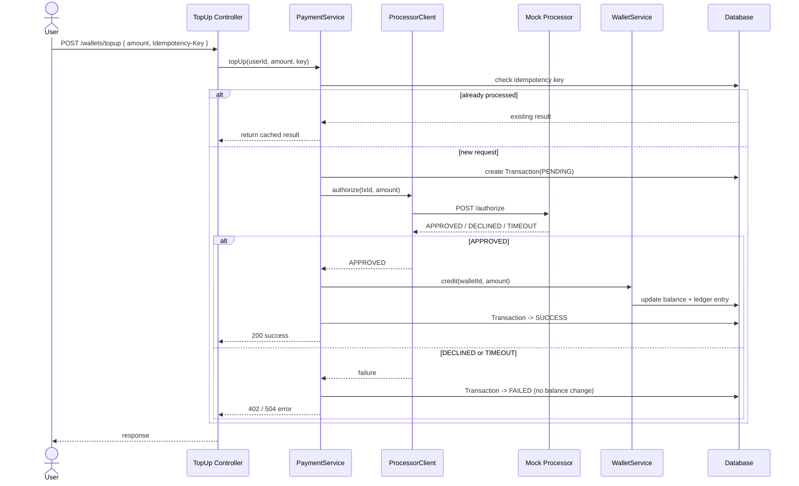
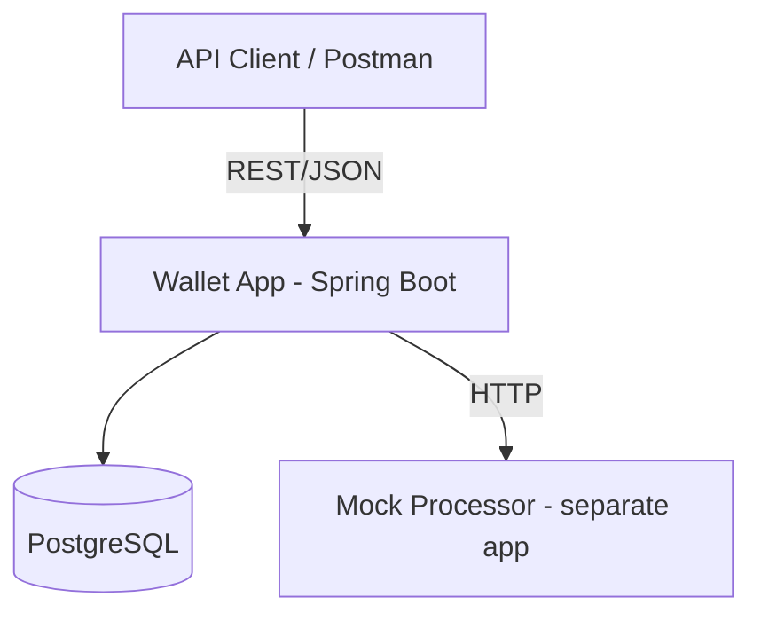
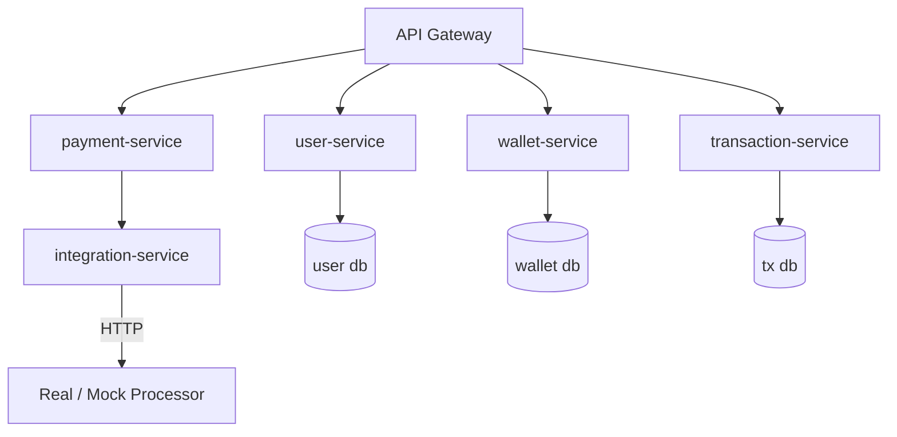

# High-Level Design (HLD)
## Digital Wallet — FinTech Intern Project

| Field | Value |
|---|---|
| Document | High-Level Design |
| Version | 1.0 |
| Stack | Java 17+ / Spring Boot 3.x, PostgreSQL |
| Architecture | Modular-Layered Monolith (microservice-ready) |
| Related | See SRS.md and LLD.md |

---

## 1. Architectural Goals

The system is a **modular-layered monolith**: one deployable unit, but internally divided into self-contained feature modules, each with its own layers. This is deliberately chosen so the team learns clean boundaries now and can extract modules into **microservices** later without rewriting business logic.

Design principles:
- **Layering** — every module follows Controller → Service → Repository → Domain.
- **Modularity** — modules talk to each other only through service interfaces, never by reaching into another module's repository or tables.
- **Dependency direction** — dependencies point inward (web depends on service, service depends on domain). Domain depends on nothing.
- **Externalized integration** — anything outside the system (the mock processor) is reached through one adapter, isolating the rest of the code from external changes.

---

## 2. Layered View

**Layer responsibilities**

| Layer | Responsibility | Must NOT do |
|---|---|---|
| Presentation | HTTP, request validation, map DTO ⇄ domain | Contain business rules |
| Service/Application | Business logic, orchestration, transactions | Handle HTTP or SQL details |
| Domain | Entities, invariants (e.g. balance ≥ 0) | Know about Spring/web |
| Infrastructure | Persistence, external HTTP, security | Contain business decisions |

---

## 3. Module View (microservice-ready boundaries)

| Module | Owns | Future Microservice |
|---|---|---|
| **User** | Registration, login, JWT, roles | `user-service` |
| **Wallet** | Balances, ledger, atomic debit/credit | `wallet-service` |
| **Transaction** | Transfers, history, transaction lifecycle | `transaction-service` |
| **Payment** | Merchant payments, top-up orchestration | `payment-service` |
| **Integration** | ProcessorClient adapter, retries, timeouts | `integration-service` / gateway |

Each module is a Java package (`com.company.wallet.<module>`) with sub-packages `web`, `service`, `domain`, `repository`. Cross-module calls go through a published `*Service` interface only — this is the seam along which microservices will later be split.

---

## 4. Request Flow — Top-up (representative money flow)

---

## 5. Deployment View

**Now (monolith):**

**Later (microservices target):**

The migration path: extract one module at a time, replace in-process service calls with REST/messaging, and give each service its own database. Because modules already avoid shared tables, this is incremental.

---

## 6. Cross-Cutting Concerns

| Concern | Approach |
|---|---|
| Security | Spring Security + JWT filter; role-based access for admin endpoints |
| Transactions | `@Transactional` at service layer; balance updates + ledger in one unit of work |
| Idempotency | `Idempotency-Key` stored with transaction; unique constraint prevents duplicates |
| Resilience | Timeout + bounded retry on ProcessorClient; failure ⇒ transaction FAILED, never inconsistent |
| Error handling | Central `@RestControllerAdvice` mapping domain exceptions to HTTP codes |
| Logging | Correlation ID via filter/MDC; structured logs at module boundaries |
| Config | `application.yml` per profile; processor URL/timeout externalized |

---

## 7. Technology Choices

| Area | Choice | Why |
|---|---|---|
| Language | Java 17+ | Records, modern APIs |
| Framework | Spring Boot 3.x | Standard for FinTech backends |
| Data | Spring Data JPA + PostgreSQL | Relational integrity for money |
| Migrations | Flyway | Versioned schema |
| HTTP client | Spring `RestClient`/`WebClient` | Calls to mock processor |
| Auth | Spring Security + JWT | Simple, standard |
| Testing | JUnit 5, Mockito, Testcontainers | Unit + integration |
| Build | Maven or Gradle | Team preference |

---

## 8. Risks & Mitigations

| Risk | Mitigation |
|---|---|
| Interns bypass module boundaries | Code review checklist; package-private repositories |
| Inconsistent balances on processor timeout | Never credit before APPROVED; transactional design |
| Scope creep | Freeze scope to High-priority FRs in SRS |
| Hardcoded processor URL | Enforce externalized config (NFR) |
