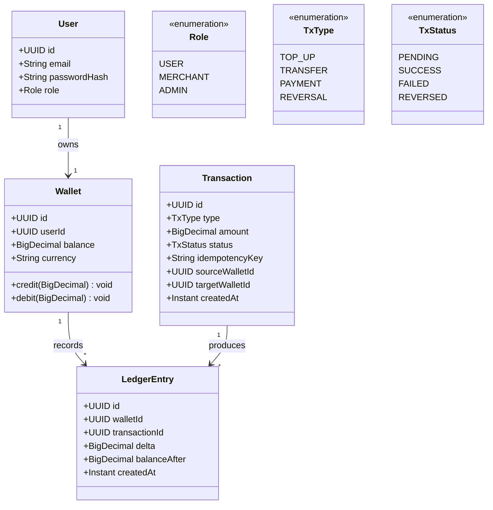
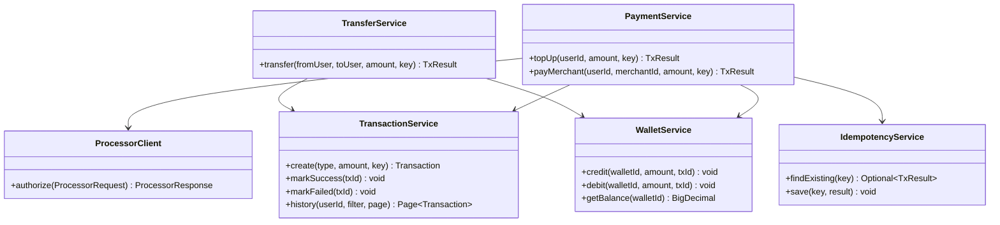
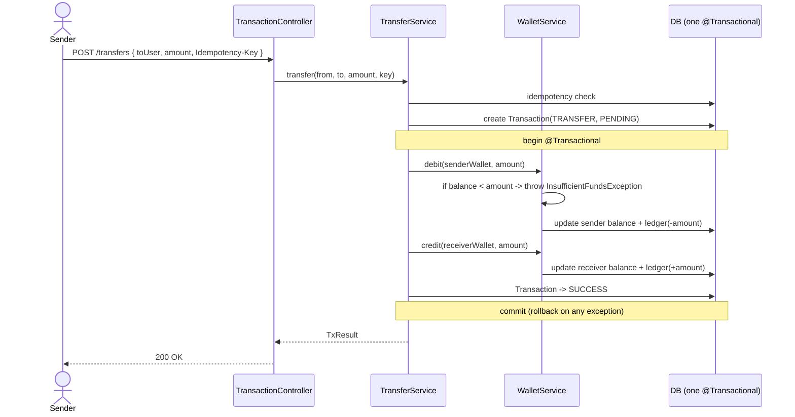
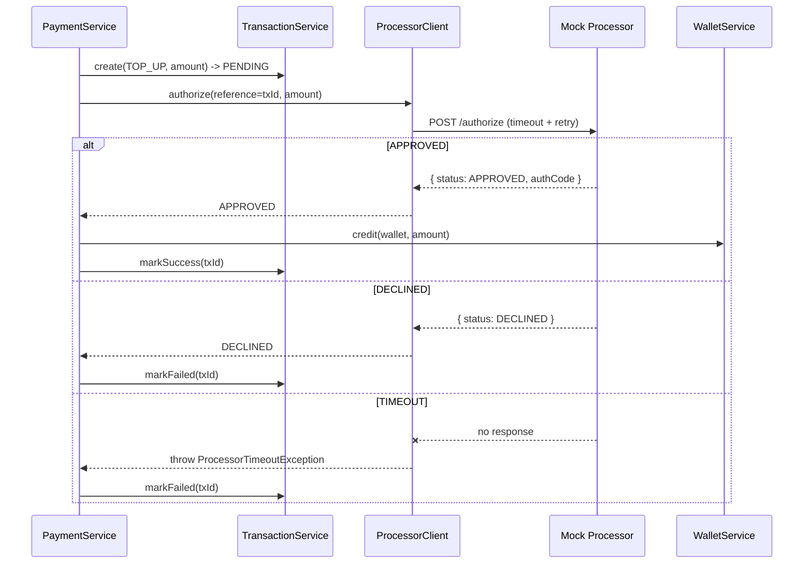
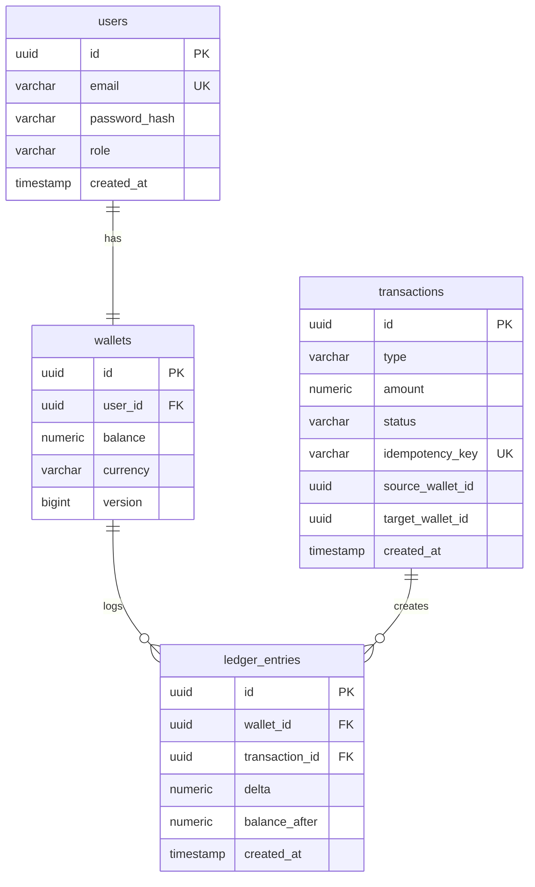

# Low-Level Design (LLD)
## Digital Wallet — FinTech Intern Project

| Field | Value |
|---|---|
| Document | Low-Level Design |
| Version | 1.0 |
| Stack | Java 17+ / Spring Boot 3.x, Spring Data JPA, PostgreSQL |
| Related | See SRS.md and HLD.md |

---

## 1. Package Structure

```
com.company.wallet
├── user
│   ├── web        (UserController, dto)
│   ├── service    (UserService, AuthService)
│   ├── domain     (User, Role)
│   └── repository (UserRepository)
├── wallet
│   ├── web        (WalletController)
│   ├── service    (WalletService)
│   ├── domain     (Wallet, LedgerEntry)
│   └── repository (WalletRepository, LedgerRepository)
├── transaction
│   ├── web        (TransactionController)
│   ├── service    (TransactionService, TransferService)
│   ├── domain     (Transaction, TxType, TxStatus)
│   └── repository (TransactionRepository)
├── payment
│   ├── web        (PaymentController, TopUpController)
│   └── service    (PaymentService)
├── integration
│   ├── client     (ProcessorClient, ProcessorRequest, ProcessorResponse)
│   └── config     (ProcessorProperties)
└── common
    ├── security   (JwtFilter, SecurityConfig)
    ├── error      (GlobalExceptionHandler, domain exceptions)
    └── config     (correlation-id filter)
```

Rule: a module's `repository` package is package-private where possible. Other modules use the module's `service` interface only.

---

## 2. Domain Model (class diagram)



**Key invariant (in `Wallet.debit`):** throw `InsufficientFundsException` if `balance - amount < 0`. Money is always `BigDecimal`, never `double`.

---

## 3. Service Layer Design (class diagram)



---

## 4. Detailed Flow — P2P Transfer (atomic, no external processor)



If any step throws, the whole `@Transactional` unit rolls back — no partial transfer is possible.

---

## 5. Detailed Flow — Top-up (with mock processor)



---

## 6. REST API Contract

| Method | Path | Auth | Body / Notes | Success |
|---|---|---|---|---|
| POST | `/api/auth/register` | none | name, email, password | 201 |
| POST | `/api/auth/login` | none | email, password → JWT | 200 |
| GET | `/api/wallets/me` | user | — | 200 balance |
| POST | `/api/wallets/topup` | user | amount, `Idempotency-Key` header | 200 |
| POST | `/api/transfers` | user | toUserId, amount, `Idempotency-Key` | 200 |
| POST | `/api/payments` | user | merchantId, amount, `Idempotency-Key` | 200 |
| GET | `/api/transactions?type=&from=&to=&page=` | user | filters + pagination | 200 |
| POST | `/api/admin/transactions/{id}/reverse` | admin | — | 200 |

**Standard error body:**
```json
{ "timestamp": "...", "status": 422, "error": "INSUFFICIENT_FUNDS", "message": "...", "correlationId": "..." }
```

**Error mapping (`GlobalExceptionHandler`):**
| Exception | HTTP |
|---|---|
| `InsufficientFundsException` | 422 |
| `DuplicateEmailException` | 409 |
| `ProcessorDeclinedException` | 402 |
| `ProcessorTimeoutException` | 504 |
| `EntityNotFoundException` | 404 |
| `Unauthorized/JWT` | 401 |

---

## 7. Database Schema



Notes:
- `wallets.version` → JPA optimistic locking to prevent lost updates on concurrent balance changes.
- `transactions.idempotency_key` → UNIQUE constraint enforces FR-7 at the DB level.
- `balance` and `amount` → `NUMERIC(19,4)`, mapped to `BigDecimal`.

---

## 8. Mock Processor — Integration Notes (for interns)

The mock is a **separate application** the interns build. The wallet system depends only on the `ProcessorClient` adapter and this contract:

```
POST {processor.base-url}/authorize
Request : { "reference": "<txId>", "amount": 100.00, "currency": "USD" }
Reply   : { "reference": "<txId>", "status": "APPROVED|DECLINED|TIMEOUT", "authCode": "..." }
```

Suggested ways to build the mock (pick one):
- A tiny separate Spring Boot app with one controller that decides the response by a rule (e.g. amount ending in `.00` → APPROVED, `.13` → DECLINED, `.99` → sleep to force TIMEOUT).
- A **WireMock** stub with scenario mappings.
- A Docker container so it can be started alongside the app via `docker-compose`.

**ProcessorClient sketch:**
```java
@Component
public class ProcessorClient {
    private final RestClient rest;          // baseUrl from ProcessorProperties
    private final ProcessorProperties props;

    public ProcessorResponse authorize(ProcessorRequest req) {
        // apply props.timeoutMs and props.retryCount
        return rest.post().uri("/authorize")
                   .body(req).retrieve()
                   .body(ProcessorResponse.class);
    }
}
```

**Config (`application.yml`):**
```yaml
processor:
  base-url: http://localhost:9090   # swap for real gateway later
  timeout-ms: 2000
  retry-count: 1
```

> The whole point: the wallet code never knows whether it is talking to a mock or a real bank. Only `base-url` changes.

---

## 9. Testing Strategy

| Level | Scope | Tools |
|---|---|---|
| Unit | Wallet invariants, service logic (processor mocked) | JUnit 5, Mockito |
| Integration | Full money flow against mock processor + real DB | Testcontainers, WireMock |
| API | Endpoint contracts, error codes, idempotency | Spring MockMvc / REST Assured |

**Must-cover cases:** transfer with insufficient funds, top-up APPROVED, top-up DECLINED, top-up TIMEOUT, duplicate idempotency key, concurrent transfers (optimistic lock).

---

## 10. Suggested Build Order (for interns)

1. Project skeleton + packages + DB (Flyway) + User/Auth.
2. Wallet module: entity, balance, ledger, credit/debit with tests.
3. Transaction module: P2P transfer (atomic) + history.
4. Integration module: `ProcessorClient` + config (point at a stub).
5. Payment module: top-up + merchant payment using the processor.
6. Idempotency, error handling, correlation-id logging.
7. Integration tests against the mock; admin reversal last.
