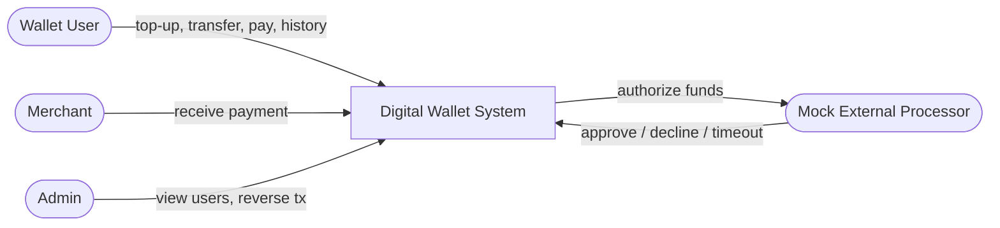
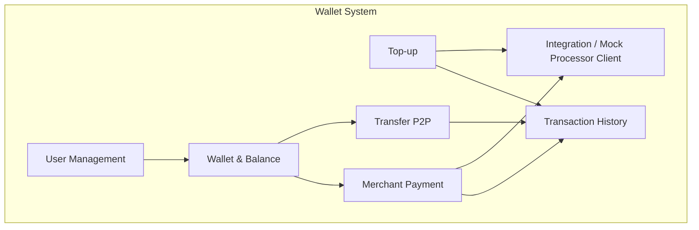
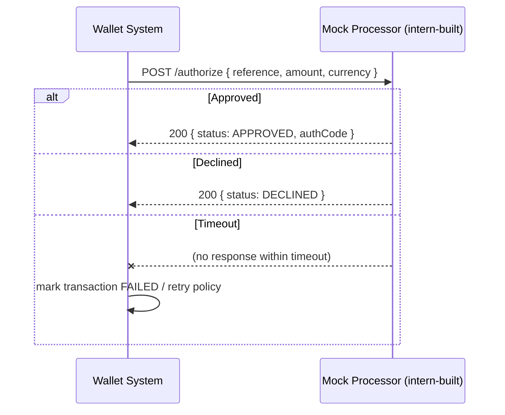
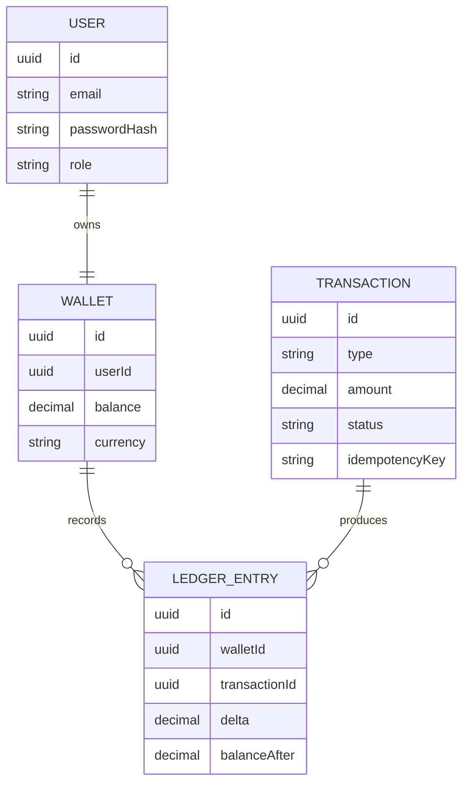

# Software Requirements Specification (SRS)
## Digital Wallet — FinTech Intern Project

| Field | Value |
|---|---|
| Project | Digital Wallet (FinTech) |
| Document | Software Requirements Specification |
| Version | 1.0 |
| Audience | Intern development team |
| Backend Stack | Java 17+ / Spring Boot 3.x |
| Architecture | Modular-Layered (migratable to microservices) |
| Frontend | Out of scope (API-only, tested via Postman/cURL) |

---

## 1. Introduction

### 1.1 Purpose
This document defines the functional and non-functional requirements for a **Digital Wallet** system. The goal is a learning-focused FinTech project that is realistic but not overly complex. It exercises a clean **modular-layered architecture** so that individual modules can later be extracted into **microservices** with minimal rework.

### 1.2 Scope
The system lets a registered user hold a balance, top it up, transfer money to another user, pay a merchant, and view transaction history. Money-moving operations that need an "external processor" (e.g. a bank or card network) call a **mock simulation system** that returns approve / decline / timeout responses. The interns will build the mock system separately — this document only defines *where* and *how* it is called.

### 1.3 Definitions
| Term | Meaning |
|---|---|
| Wallet | An account holding a monetary balance for one user |
| Ledger | Immutable append-only record of every balance change |
| Top-up | Adding funds to a wallet from an external source |
| Transfer | Moving funds from one wallet to another |
| Mock Processor | Simulated external bank/card system (built by interns) |
| Idempotency Key | Client-supplied key ensuring a request runs at most once |

### 1.4 Actors


---

## 2. Overall Description

### 2.1 Product Perspective
The Digital Wallet is a standalone backend service exposing a REST API. Internally it is split into **feature modules** (User, Wallet, Transaction, Payment, Integration). Each module owns its layers (controller → service → repository → domain). This keeps module boundaries clean so any module can be lifted into its own microservice later.

### 2.2 High-Level Feature Map


### 2.3 Assumptions & Constraints
- Single currency (e.g. USD) to keep scope small.
- No real money; all external authorization goes through the mock processor.
- No frontend; all testing via API clients (Postman, cURL, or automated tests).
- Persistence via a relational database (PostgreSQL recommended; H2 acceptable for local dev).
- Authentication is basic (JWT) — enough to identify a user, not a full IAM.

---

## 3. Functional Requirements

Each requirement has an ID (FR-x), priority, and acceptance criteria.

### FR-1 — User Registration & Login *(Priority: High)*
- The system shall let a user register with name, email, and password.
- The system shall issue a JWT on successful login.
- **Acceptance:** Registering a duplicate email returns `409 Conflict`. Login with wrong password returns `401`.

### FR-2 — Create Wallet *(High)*
- On registration, the system shall automatically create one wallet with a zero balance for the user.
- **Acceptance:** A newly registered user has exactly one wallet with balance = 0.

### FR-3 — Top-up Wallet *(High)*
- A user shall add funds to their wallet by specifying an amount.
- The system shall call the **mock processor** to authorize the external debit before crediting the wallet.
- **Acceptance:** On mock `APPROVED`, balance increases and a `TOP_UP` ledger entry is created. On `DECLINED`, balance is unchanged and the transaction is marked `FAILED`.

### FR-4 — Peer-to-Peer Transfer *(High)*
- A user shall transfer funds to another user's wallet.
- The system shall reject a transfer that exceeds the sender's available balance.
- The debit and credit shall occur in a single atomic transaction.
- **Acceptance:** Transferring more than the balance returns `422` with `INSUFFICIENT_FUNDS`. On success, sender balance decreases and receiver balance increases by the same amount; two ledger entries are created.

### FR-5 — Merchant Payment *(Medium)*
- A user shall pay a registered merchant an amount.
- The system shall call the **mock processor** to authorize the payment.
- **Acceptance:** On approval, funds move from user to merchant wallet and a `PAYMENT` ledger entry is created.

### FR-6 — Transaction History *(Medium)*
- A user shall retrieve a paginated list of their transactions, filterable by type and date range.
- **Acceptance:** History returns transactions in reverse-chronological order with correct pagination metadata.

### FR-7 — Idempotency *(Medium)*
- Money-moving endpoints shall accept an `Idempotency-Key` header. A repeated request with the same key shall return the original result without moving money twice.
- **Acceptance:** Sending the same top-up request twice with the same key results in one balance change.

### FR-8 — Admin View & Reversal *(Low)*
- An admin shall list users and reverse a specific transaction.
- **Acceptance:** A reversed transaction creates a compensating ledger entry and restores balances.

---

## 4. External Interface / Simulation Requirements

### 4.1 Mock Processor Interface *(built separately by interns)*
The system integrates with an external processor **only through a single adapter** (`ProcessorClient`). The interns will implement the mock processor as a separate deployable (a small Spring Boot app, a WireMock stub, or a Docker container). This SRS only fixes the contract.

**Where it is called:** Top-up (FR-3) and Merchant Payment (FR-5), from the Integration module.

**How it is called (contract):**
```
POST {processor.base-url}/authorize
Request  : { "reference": "<txId>", "amount": 100.00, "currency": "USD" }
Response : { "reference": "<txId>", "status": "APPROVED|DECLINED|TIMEOUT", "authCode": "abc123" }
```



> **Note for interns:** The mock's job is to return configurable responses so you can test happy path, decline, and timeout without a real bank. Keep the URL in `application.yml` (`processor.base-url`) so it can be swapped later for a real gateway.

### 4.2 Configuration
- `processor.base-url`, `processor.timeout-ms`, and `processor.retry-count` shall be externalized in configuration (no hardcoded URLs).

---

## 5. Non-Functional Requirements

| ID | Category | Requirement |
|---|---|---|
| NFR-1 | Performance | A wallet operation (excluding processor latency) shall complete in < 300 ms locally. |
| NFR-2 | Consistency | All balance changes shall be transactional (ACID); no partial transfers. |
| NFR-3 | Auditability | Every balance change shall produce an immutable ledger entry. |
| NFR-4 | Security | Passwords hashed (BCrypt); endpoints protected by JWT; no secrets in code. |
| NFR-5 | Modularity | Modules shall not access each other's repositories directly — only via service interfaces. |
| NFR-6 | Resilience | Processor calls shall have a timeout and a bounded retry; failure never leaves an inconsistent balance. |
| NFR-7 | Observability | Requests shall be logged with a correlation ID; key events logged at INFO. |
| NFR-8 | Testability | Each module shall have unit tests; money flows shall have integration tests. |

---

## 6. Data Requirements (Conceptual)


---

## 7. Acceptance & Out of Scope

**Definition of Done (project level):** All High-priority FRs implemented, money flows covered by integration tests against the mock processor, and modules cleanly separated per NFR-5.

**Out of scope:** Real bank integration, multi-currency, FX, KYC/AML, mobile/web UI, and production-grade security hardening.
